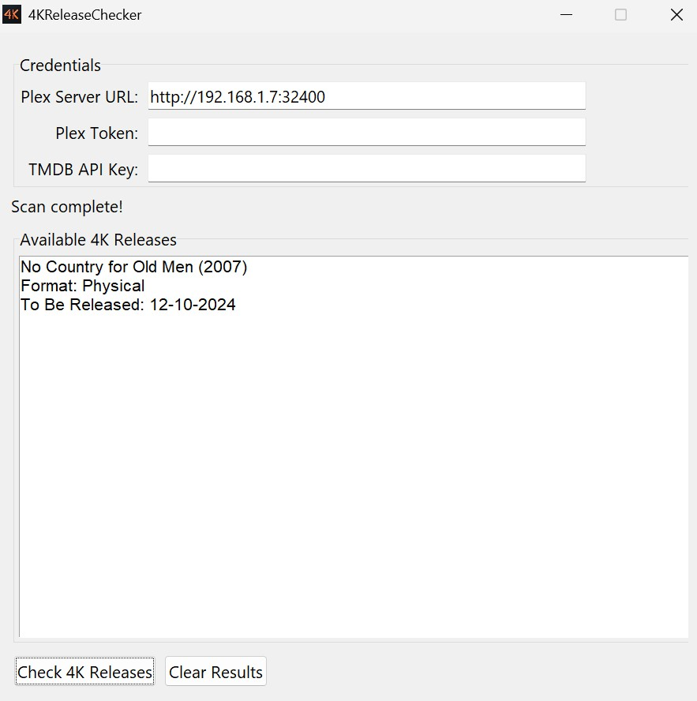

# 4KReleaseChecker
  
  
Checks your Plex library for 1080p releases that have a 4K version available.  
  
Requires a [TMDB API Key](https://developer.themoviedb.org/docs/getting-started).  
  
You can find your Plex Token by following [this guide](https://support.plex.tv/articles/204059436-finding-an-authentication-token-x-plex-token/).  
  
You can find your Plex Server URL in Plex Web App > Settings > Settings > Remote Access. If the PC you run this app on is the Plex server you can use localhost.  
The url must be input as http://<server ip>:<port>
  
Some results may not be accurate. This is determined by TMDB, not this app. However, false positives seem very rare.  
  
PC users can use the exe from releases page, Mac users can download the py file and run it with python.  
  
This app is being actively developed so there may be some bugs.
